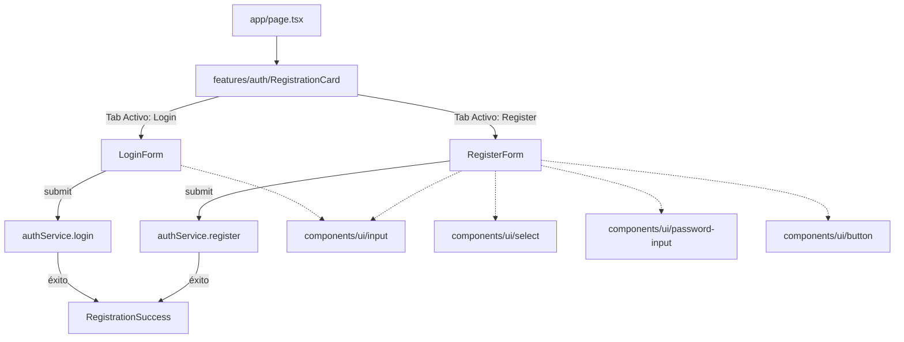

# Arquitectura del Frontend - Sentria AI

Este documento describe la arquitectura técnica, la estructura de directorios, las convenciones de diseño y las responsabilidades de cada capa en el frontend de **Sentria AI**.

---

## 1. Principios de Arquitectura

El proyecto adopta el patrón **Feature-Driven Architecture (Vertical Slice)** sobre **Next.js (App Router)** y **Tailwind CSS v4**:

1. **Alta Cohesión por Dominio (*Features*):** La lógica de negocio, componentes específicos, servicios y tipos se agrupan por dominio funcional (ej. autenticación, triage clínico, landing) en lugar de dispersarse por capas técnicas planas.
2. **Componentes Atómicos Reutilizables (*UI Library*):** Los elementos visuales genéricos (botones, inputs, selects, badges) son agnósticos de la lógica de negocio y residen en `components/ui/`.
3. **Desacoplamiento de la Capa de Datos (*Services & Data Layer*):** Las llamadas de red, APIs institucionales y transformaciones de datos están aisladas en servicios dedicados (`features/[feature]/services/`).
4. **Tipado Estricto (*TypeScript first*):** Todos los modelos de datos, inputs de formularios y respuestas de servicios cuentan con contratos de tipos explícitos en `types/`.
5. **Cumplimiento de Tokens y Accesibilidad (*Design Tokens & WCAG*):** Los estilos respetan el sistema de diseño estipulado en `DESIGN.md` y emplean el helper `cn()` (`clsx` + `tailwind-merge`) para una composición robusta de clases CSS.

---

## 2. Estructura de Directorios

```text
sentria_ia-frontend/
├── app/                             # Rutas, layouts y páginas de Next.js (App Router)
│   ├── favicon.ico
│   ├── globals.css                  # Variables CSS, tokens del theme y tipografía
│   ├── layout.tsx                   # Root Layout con fuentes y metadatos SEO
│   └── page.tsx                     # Página principal (Home / Landing de Registro)
│
├── components/                      # Componentes de UI compartidos y atómicos
│   ├── ui/                          # Componentes atómicos agnósticos de negocio
│   │   ├── badge.tsx                # Chips de estado y severidad clínica
│   │   ├── button.tsx               # Botón interactivo con variantes y estado de carga
│   │   ├── input.tsx                # Campo de texto con soporte para iconos y errores
│   │   ├── password-input.tsx       # Input de contraseña con medidor de seguridad
│   │   └── select.tsx               # Selector accesible estilizado
│   └── shared/                      # Componentes de estructura global de la aplicación
│       ├── site-header.tsx          # Cabecera institucional con badges de acreditación
│       └── site-footer.tsx          # Pie de página con banner de emergencia 24/7 y legales
│
├── features/                        # Módulos organizados por dominio funcional (Vertical Slices)
│   ├── auth/                        # Dominio de Autenticación y Registro de Pacientes
│   │   ├── components/
│   │   │   ├── login-form.tsx       # Formulario de inicio de sesión
│   │   │   ├── register-form.tsx    # Formulario multisección de alta de paciente
│   │   │   ├── registration-card.tsx # Orquestador de tabs y feedback visual
│   │   │   └── registration-success.tsx # Vista de confirmación de éxito
│   │   └── services/
│   │       └── auth.service.ts      # Comunicación con API y simulación de red
│   │
│   └── landing/                     # Dominio de Presentación Institucional y Valor
│       └── components/
│           ├── telemetry-chart.tsx  # Gráfico animado de telemetría y métricas ESI
│           └── value-panel.tsx      # Panel descriptivo de beneficios y satisfacción
│
├── lib/                             # Utilidades y configuración transversal
│   └── utils.ts                     # Helper cn() para merge inteligente de Tailwind
│
├── types/                           # Modelos, contratos de API e interfaces TypeScript
│   └── auth.ts                      # Tipos para registro, login y respuestas de auth
│
├── public/                          # Recursos estáticos (imágenes, iconos, SVGs)
├── DESIGN.md                        # Guía de tokens de diseño, colores y tipografía
├── package.json                     # Dependencias y scripts de construcción
└── tsconfig.json                    # Configuración de TypeScript con alias @/*
```

---

## 3. Función y Responsabilidad de cada Directorio

### `app/` (Enrutamiento y Layouts)
- **Función:** Define las rutas públicas y privadas de la aplicación mediante el App Router de Next.js.
- **Responsabilidad:** No debe contener lógica de negocio compleja ni formularios extensos. Se limita a orquestar las *features* dentro de los layouts correspondientes.
- **Evolución planificada:**
  - `app/(auth)/login/page.tsx` y `app/(auth)/register/page.tsx` para rutas de autenticación directas.
  - `app/(patient)/portal/page.tsx` para el dashboard de pacientes.
  - `app/(clinical)/triage/page.tsx` para el flujo de triage asistido.

### `components/ui/` (Design System Atómico)
- **Función:** Contiene los componentes de UI reutilizables (Design System).
- **Reglas:**
  - No conocen el modelo de datos de la aplicación (`Patient`, `Triage`, etc.).
  - Soportan la prop `className` y la combinan utilizando `cn()`.
  - Implementan accesibilidad (`aria-*`, `htmlFor` sincronizado con `useId`).

### `components/shared/` (Componentes Globales de Layout)
- **Función:** Componentes estructurales que se repiten a lo largo de múltiples páginas o layouts (ej. `SiteHeader`, `SiteFooter`, modales globales).

### `features/` (Módulos de Negocio)
Cada subcarpeta en `features/` representa una funcionalidad de negocio independiente:
- **`features/auth/`:**
  - `components/`: Subcomponentes modulares de login, registro y confirmación.
  - `services/`: Métodos para interactuar con los endpoints de autenticación y validación de cobertura sanitaria.
- **`features/landing/`:**
  - Componentes del panel informativo, métricas de satisfacción y telemetría de triage.
- **Nuevas features a incorporar según hoja de ruta:**
  - `features/triage/`: Algoritmo de clasificación sintomática ESI v4.
  - `features/appointments/`: Autogestión de turnos médicos y telemedicina.

### `lib/` (Utilidades Compartidas)
- **`lib/utils.ts`:** Provee la función `cn(...inputs)` que combina `clsx` y `tailwind-merge` para resolver colisiones de clases CSS de Tailwind de forma determinista.

### `types/` (Tipos e Interfaces Globales)
- Centraliza las definiciones de tipos TypeScript compartidos entre múltiples features, componentes y servicios.

---

## 4. Flujo de Datos del Formulario de Registro



---

## 5. Estándares y Buenas Prácticas

1. **Evitar Monolitos:** Ningún archivo de componente debe superar ~200 líneas; si crece, se divide en subcomponentes dentro del directorio `features/[nombre]/components/`.
2. **Validación de Formularios:** Se recomienda utilizar esquemas tipados (Zod) vinculados a `react-hook-form` al expandir los campos de validación médica.
3. **Consistencia de Estilos:** Utilizar siempre las clases semánticas definidas en `app/globals.css` (`bg-surface`, `text-primary`, `p-space-md`, etc.) para mantener la identidad visual del proyecto.

---

## 6. Hoja de Ruta de Seguridad y Próxima Etapa (Roadmap)

Para la siguiente etapa de desarrollo e integración con el backend productivo, se deben implementar las siguientes recomendaciones arquitectónicas:

### 6.1. Migración a Cookies de Sesión `HttpOnly; Secure; SameSite=Strict`
* **Objetivo:** Cumplimiento estricto de la **Ley 25.326 (Protección de Datos Personales)** y estándares **HIPAA / HITECH**.
* **Detalle:** Reemplazar la persistencia del token JWT en `localStorage` por cookies emitidas directamente por el backend con los atributos `HttpOnly`, `Secure` y `SameSite=Strict`.
* **Beneficio:** Inmunidad contra el robo o exfiltración de tokens JWT mediante ataques Cross-Site Scripting (XSS).

### 6.2. Protección de Rutas mediante Middleware de Next.js (`middleware.ts`)
* **Objetivo:** Control de acceso en el servidor antes del renderizado de páginas privadas.
* **Detalle:** Interceptar rutas como `/portal/:path*` verificando la presencia y validez de la cookie de sesión en el borde (Edge runtime), redireccionando a `/` si el usuario no está autenticado sin parpadeos en el cliente.

### 6.3. Rotación de Credenciales y Refresh Tokens
* **Objetivo:** Minimizar la ventana de exposición de sesiones.
* **Detalle:** Establecer tokens de acceso de corta duración (~15 minutos) combinados con endpoints de refresco silencioso (`/api/auth/refresh`) y revocación explícita en el cierre de sesión (`/api/auth/logout`).

### 6.4. Escalado de Formularios con `react-hook-form` y `zod`
* **Objetivo:** Reducción de boilerplate y validaciones asíncronas para padrones y matrículas médicas.
* **Detalle:** Migrar los esquemas manuales de `auth.schema.ts` a esquemas Zod con validaciones cruzadas e inferencia estricta de tipos.

