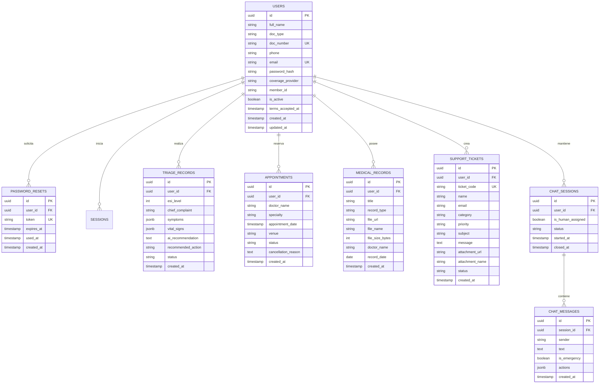

# Especificación de Base de Datos y Modelo de Datos - Sentria AI

Este documento detalla el esquema relacional, diccionario de datos, tipos, restricciones y contratos de API necesarios en el backend para dar soporte completo a la interfaz y flujos de **Sentria AI**.

---

## 1. Diagrama Entidad-Relación (ERD)



---

## 2. Diccionario de Datos Detallado

### 2.1. Tabla: `users` (Pacientes y Usuarios)
Representa la ficha clínica y credencial de acceso del paciente. Mapea directamente el formulario de registro (`features/auth/components/register-form.tsx`), el inicio de sesión (`features/auth/components/login-form.tsx`) y el encabezado/tarjetas del portal (`app/portal/page.tsx`).

| Campo | Tipo SQL | Restricciones / Enums | Origen en Frontend | Descripción |
| :--- | :--- | :--- | :--- | :--- |
| `id` | `UUID` | **PRIMARY KEY**, Default `gen_random_uuid()` | `user.id` | Identificador único del paciente / Ficha ID |
| `full_name` | `VARCHAR(150)` | **NOT NULL** | `formData.fullName` | Nombre y apellido completo |
| `doc_type` | `VARCHAR(10)` | **NOT NULL**, Enum: `'DNI', 'LC', 'LE', 'PAS'` | `formData.docType` | Tipo de documento nacional o pasaporte |
| `doc_number` | `VARCHAR(30)` | **NOT NULL**, **UNIQUE**, Index | `formData.docNumber` | Número de documento sanitizado |
| `phone` | `VARCHAR(30)` | **NOT NULL** | `formData.phone` | Teléfono móvil formateado (`+54...`) |
| `email` | `VARCHAR(255)` | **NOT NULL**, **UNIQUE**, Index | `formData.email` | Correo electrónico principal (lowercase) |
| `password_hash` | `VARCHAR(255)` | **NOT NULL** | `formData.password` | Hash seguro (bcrypt / Argon2id) |
| `coverage_provider` | `VARCHAR(60)` | **NOT NULL**, Enum: `'OSDE', 'Swiss Medical', 'Galeno', 'Medife', 'Omint', 'Particular'` | `formData.coverageProvider` | Cobertura médica u obra social |
| `member_id` | `VARCHAR(60)` | **NULLABLE** (requerido si `coverage_provider != 'Particular'`) | `formData.memberId` | Nº de credencial / afiliado |
| `is_active` | `BOOLEAN` | **DEFAULT `TRUE`** | — | Permite deshabilitar temporalmente la cuenta |
| `terms_accepted_at` | `TIMESTAMP` | **NOT NULL** | `formData.acceptTerms` | Fecha y hora de aceptación legal (Ley 25.326) |
| `created_at` | `TIMESTAMP` | **DEFAULT `NOW()`** | `createdAt` | Fecha de creación de la ficha |
| `updated_at` | `TIMESTAMP` | **DEFAULT `NOW()`** | — | Fecha de última modificación |

---

### 2.2. Tabla: `password_resets` (Recuperación de Contraseñas)
Soporta el flujo seguro de reseteo de claves (`features/auth/components/forgot-password-modal.tsx`).

| Campo | Tipo SQL | Restricciones | Descripción |
| :--- | :--- | :--- | :--- |
| `id` | `UUID` | **PRIMARY KEY**, Default `gen_random_uuid()` | ID de la solicitud de restablecimiento |
| `user_id` | `UUID` | **NOT NULL**, **FOREIGN KEY** -> `users(id)` ON DELETE CASCADE | Paciente solicitante |
| `token` | `VARCHAR(128)` | **NOT NULL**, **UNIQUE**, Index | Token uniuso criptográfico enviado por email |
| `expires_at` | `TIMESTAMP` | **NOT NULL** | Fecha y hora de caducidad (ej. 15-30 min) |
| `used_at` | `TIMESTAMP` | **NULLABLE** | Fecha y hora de uso efectivo |
| `created_at` | `TIMESTAMP` | **DEFAULT `NOW()`** | Momento de generación |

---

### 2.3. Tabla: `triage_records` (Evaluaciones Clínicas y Triage ESI v4)
Almacena el resultado de la clasificación sintomática asistida por IA. Conecta con el gráfico de telemetría (`features/landing/components/telemetry-chart.tsx`) y el módulo de triage del portal.

| Campo | Tipo SQL | Restricciones / Enums | Descripción |
| :--- | :--- | :--- | :--- |
| `id` | `UUID` | **PRIMARY KEY**, Default `gen_random_uuid()` | ID único del triage |
| `user_id` | `UUID` | **NOT NULL**, **FOREIGN KEY** -> `users(id)` ON DELETE CASCADE | Paciente evaluado |
| `esi_level` | `SMALLINT` | **NOT NULL**, Check `1 <= esi_level <= 5` | Nivel ESI: 1 (Resucitación), 2 (Emergencia), 3 (Urgente), 4 (Menos urgente), 5 (No urgente) |
| `chief_complaint` | `TEXT` | **NOT NULL** | Motivo principal de la consulta / síntoma guía |
| `symptoms` | `JSONB` | **DEFAULT `'[]'`** | Lista de síntomas reportados estructurados |
| `vital_signs` | `JSONB` | **NULLABLE** | Signos vitales: `{ heart_rate, bp_systolic, bp_diastolic, o2_sat, temp, respiratory_rate }` |
| `ai_recommendation` | `TEXT` | **NOT NULL** | Informe y razonamiento clínico generado por la IA |
| `recommended_action` | `VARCHAR(50)` | Enum: `'guardia_inmediata', 'consulta_24h', 'telemedicina', 'autocuidado'` | Conducta médica sugerida |
| `status` | `VARCHAR(30)` | Enum: `'evaluado', 'en_espera', 'en_atencion', 'completado', 'derivado'`, Default: `'evaluado'` | Estado en el flujo hospitalario |
| `created_at` | `TIMESTAMP` | **DEFAULT `NOW()`** | Momento de la consulta |

---

### 2.4. Tabla: `appointments` (Gestión de Turnos y Citas)
Soporta el panel de "Mis Turnos" y solicitud de nuevas citas del portal (`app/portal/page.tsx`).

| Campo | Tipo SQL | Restricciones / Enums | Descripción |
| :--- | :--- | :--- | :--- |
| `id` | `UUID` | **PRIMARY KEY**, Default `gen_random_uuid()` | ID del turno médico |
| `user_id` | `UUID` | **NOT NULL**, **FOREIGN KEY** -> `users(id)` ON DELETE CASCADE | Paciente que solicitó el turno |
| `doctor_name` | `VARCHAR(150)` | **NOT NULL** | Nombre del profesional médico |
| `specialty` | `VARCHAR(100)` | **NOT NULL** | Especialidad médica (ej. Cardiología, Clínica) |
| `appointment_date` | `TIMESTAMP` | **NOT NULL** | Fecha y hora de la consulta |
| `venue` | `VARCHAR(120)` | Ej: `'Sede Central - Consultorio 12', 'Sede Norte', 'Telemedicina'` | Lugar de atención |
| `status` | `VARCHAR(30)` | Enum: `'pendiente', 'confirmado', 'en_curso', 'completado', 'cancelado'`, Default: `'pendiente'` | Estado del turno |
| `cancellation_reason`| `TEXT` | **NULLABLE** | Motivo en caso de ser cancelado |
| `created_at` | `TIMESTAMP` | **DEFAULT `NOW()`** | Fecha de reserva del turno |

---

### 2.5. Tabla: `medical_records` (Historial Clínico y Estudios)
Soporta el módulo "Historial Clínico y Estudios" del portal (`app/portal/page.tsx`).

| Campo | Tipo SQL | Restricciones / Enums | Descripción |
| :--- | :--- | :--- | :--- |
| `id` | `UUID` | **PRIMARY KEY**, Default `gen_random_uuid()` | ID del registro clínico |
| `user_id` | `UUID` | **NOT NULL**, **FOREIGN KEY** -> `users(id)` ON DELETE CASCADE | Paciente titular |
| `title` | `VARCHAR(200)` | **NOT NULL** | Nombre del estudio (ej. *Hemograma Completo*, *Radiografía de Tórax*) |
| `record_type` | `VARCHAR(50)` | Enum: `'laboratorio', 'imagenologia', 'diagnostico', 'receta', 'evolucion'` | Categoría del informe |
| `file_url` | `VARCHAR(500)` | **NOT NULL** | URL del documento PDF o imagen firmado digitalmente (S3/GCS) |
| `file_name` | `VARCHAR(255)` | **NOT NULL** | Nombre legible del archivo |
| `file_size_bytes` | `INTEGER` | **NOT NULL** | Tamaño en bytes para feedback en UI |
| `doctor_name` | `VARCHAR(150)` | **NULLABLE** | Médico firmante o emisor |
| `record_date` | `DATE` | **NOT NULL** | Fecha de realización |
| `created_at` | `TIMESTAMP` | **DEFAULT `NOW()`** | Fecha de subida al sistema |

---

### 2.6. Tabla: `support_tickets` (Mesa de Ayuda y Contacto por Correo)
Mapea el formulario modal de contacto con soporte (`features/help/components/support-email-modal.tsx`).

| Campo | Tipo SQL | Restricciones / Enums | Origen en Frontend |
| :--- | :--- | :--- | :--- |
| `id` | `UUID` | **PRIMARY KEY**, Default `gen_random_uuid()` | ID interno del ticket |
| `user_id` | `UUID` | **NULLABLE**, **FOREIGN KEY** -> `users(id)` | Usuario autenticado (si aplica) |
| `ticket_code` | `VARCHAR(30)` | **NOT NULL**, **UNIQUE**, Ej: `'TKT-584912'` | `ticketResult.ticketId` |
| `name` | `VARCHAR(150)` | **NOT NULL** | `formData.name` |
| `email` | `VARCHAR(255)` | **NOT NULL** | `formData.email` |
| `category` | `VARCHAR(50)` | **NOT NULL**, Enum: `'turnos', 'acceso', 'cobertura', 'laboratorio', 'triage', 'facturacion', 'otro'` | `formData.category` |
| `priority` | `VARCHAR(20)` | **NOT NULL**, Enum: `'normal', 'urgente'` | `formData.priority` |
| `subject` | `VARCHAR(200)` | **NOT NULL** | `formData.subject` |
| `message` | `TEXT` | **NOT NULL** | `formData.message` |
| `attachment_url` | `VARCHAR(500)` | **NULLABLE** | URL de archivo adjunto (hasta 10MB) |
| `attachment_name`| `VARCHAR(255)` | **NULLABLE** | Nombre del archivo adjunto |
| `status` | `VARCHAR(30)` | Enum: `'abierto', 'en_proceso', 'resuelto', 'cerrado'`, Default: `'abierto'` | Estado de resolución |
| `created_at` | `TIMESTAMP` | **DEFAULT `NOW()`** | Hora y fecha de envío |

---

### 2.7. Tablas: `chat_sessions` y `chat_messages` (Asistente Virtual y Operador)
Mapea las conversaciones del modal interactivo de ayuda (`features/help/components/help-chat-modal.tsx`).

#### `chat_sessions`:
| Campo | Tipo SQL | Restricciones | Descripción |
| :--- | :--- | :--- | :--- |
| `id` | `UUID` | **PRIMARY KEY**, Default `gen_random_uuid()` | Identificador de la sesión de chat |
| `user_id` | `UUID` | **NULLABLE**, **FOREIGN KEY** -> `users(id)` | Paciente logueado o anónimo |
| `is_human_assigned`| `BOOLEAN` | **DEFAULT `FALSE`** | Indica si un operador humano tomó la sesión |
| `status` | `VARCHAR(20)` | Enum: `'activa', 'cerrada'`, Default: `'activa'` | Estado de la sesión |
| `started_at` | `TIMESTAMP` | **DEFAULT `NOW()`** | Inicio de conversación |
| `closed_at` | `TIMESTAMP` | **NULLABLE** | Cierre de conversación |

#### `chat_messages`:
| Campo | Tipo SQL | Restricciones / Enums | Descripción |
| :--- | :--- | :--- | :--- |
| `id` | `UUID` | **PRIMARY KEY**, Default `gen_random_uuid()` | Identificador del mensaje |
| `session_id` | `UUID` | **NOT NULL**, **FOREIGN KEY** -> `chat_sessions(id)` ON DELETE CASCADE | Sesión asociada |
| `sender` | `VARCHAR(20)` | **NOT NULL**, Enum: `'bot', 'user', 'human_agent', 'system'` | Emisor del mensaje |
| `text` | `TEXT` | **NOT NULL** | Texto del mensaje |
| `is_emergency` | `BOOLEAN` | **DEFAULT `FALSE`** | `true` si disparó protocolo de emergencia (911) |
| `actions` | `JSONB` | **DEFAULT `'[]'`** | Opciones o botones de respuesta sugerida `[{ label, action }]` |
| `created_at` | `TIMESTAMP` | **DEFAULT `NOW()`** | Timestamp del mensaje |

---

## 3. Matriz de Endpoints REST (Backend)

| Módulo | Método | Endpoint | Tabla Principal | Payload / Descripción |
| :--- | :--- | :--- | :--- | :--- |
| **Auth** | `POST` | `/api/auth/register` | `users` | Body: `PatientRegistrationInput`. Devuelve JWT y `AuthUser`. |
| **Auth** | `POST` | `/api/auth/login` | `users` | Body: `PatientLoginInput`. Devuelve JWT y `AuthUser`. |
| **Auth** | `POST` | `/api/auth/forgot-password` | `password_resets` | Body: `{ email }`. Genera token y envía correo. |
| **Portal** | `GET` | `/api/patient/me` | `users` | Headers: `Authorization: Bearer <token>`. Devuelve perfil. |
| **Portal** | `GET` | `/api/patient/appointments` | `appointments` | Headers: `Authorization: Bearer <token>`. Lista turnos activos. |
| **Portal** | `POST` | `/api/patient/appointments` | `appointments` | Body: `{ doctorName, specialty, appointmentDate, venue }`. |
| **Portal** | `GET` | `/api/patient/records` | `medical_records` | Headers: `Authorization: Bearer <token>`. Lista estudios. |
| **Triage** | `POST` | `/api/triage/evaluate` | `triage_records` | Body: `{ chiefComplaint, symptoms, vitalSigns }`. Devuelve clasificación ESI v4. |
| **Soporte** | `POST` | `/api/support/tickets` | `support_tickets` | Multipart Form: Datos del formulario + adjunto. Devuelve `ticketId`. |
| **Chat** | `POST` | `/api/support/chat/session` | `chat_sessions` | Inicia nueva sesión de chat. |
| **Chat** | `POST` | `/api/support/chat/message` | `chat_messages` | Envía mensaje de usuario y retorna respuesta de bot/humano. |

---

## 4. Script DDL de Inicialización (PostgreSQL)

```sql
-- Habilitar extensión para UUIDs
CREATE EXTENSION IF NOT EXISTS "uuid-ossp";

-- 1. Tabla de Usuarios / Pacientes
CREATE TABLE users (
    id UUID PRIMARY KEY DEFAULT uuid_generate_v4(),
    full_name VARCHAR(150) NOT NULL,
    doc_type VARCHAR(10) NOT NULL CHECK (doc_type IN ('DNI', 'LC', 'LE', 'PAS')),
    doc_number VARCHAR(30) NOT NULL UNIQUE,
    phone VARCHAR(30) NOT NULL,
    email VARCHAR(255) NOT NULL UNIQUE,
    password_hash VARCHAR(255) NOT NULL,
    coverage_provider VARCHAR(60) NOT NULL,
    member_id VARCHAR(60),
    is_active BOOLEAN NOT NULL DEFAULT TRUE,
    terms_accepted_at TIMESTAMP WITH TIME ZONE NOT NULL DEFAULT NOW(),
    created_at TIMESTAMP WITH TIME ZONE NOT NULL DEFAULT NOW(),
    updated_at TIMESTAMP WITH TIME ZONE NOT NULL DEFAULT NOW()
);

CREATE INDEX idx_users_email ON users(email);
CREATE INDEX idx_users_doc_number ON users(doc_number);

-- 2. Recuperación de Contraseña
CREATE TABLE password_resets (
    id UUID PRIMARY KEY DEFAULT uuid_generate_v4(),
    user_id UUID NOT NULL REFERENCES users(id) ON DELETE CASCADE,
    token VARCHAR(128) NOT NULL UNIQUE,
    expires_at TIMESTAMP WITH TIME ZONE NOT NULL,
    used_at TIMESTAMP WITH TIME ZONE,
    created_at TIMESTAMP WITH TIME ZONE NOT NULL DEFAULT NOW()
);

-- 3. Triage Clínico (ESI v4)
CREATE TABLE triage_records (
    id UUID PRIMARY KEY DEFAULT uuid_generate_v4(),
    user_id UUID NOT NULL REFERENCES users(id) ON DELETE CASCADE,
    esi_level SMALLINT NOT NULL CHECK (esi_level BETWEEN 1 AND 5),
    chief_complaint TEXT NOT NULL,
    symptoms JSONB NOT NULL DEFAULT '[]'::jsonb,
    vital_signs JSONB,
    ai_recommendation TEXT NOT NULL,
    recommended_action VARCHAR(50) NOT NULL,
    status VARCHAR(30) NOT NULL DEFAULT 'evaluado',
    created_at TIMESTAMP WITH TIME ZONE NOT NULL DEFAULT NOW()
);

-- 4. Turnos y Citas Médicas
CREATE TABLE appointments (
    id UUID PRIMARY KEY DEFAULT uuid_generate_v4(),
    user_id UUID NOT NULL REFERENCES users(id) ON DELETE CASCADE,
    doctor_name VARCHAR(150) NOT NULL,
    specialty VARCHAR(100) NOT NULL,
    appointment_date TIMESTAMP WITH TIME ZONE NOT NULL,
    venue VARCHAR(120) NOT NULL,
    status VARCHAR(30) NOT NULL DEFAULT 'pendiente',
    cancellation_reason TEXT,
    created_at TIMESTAMP WITH TIME ZONE NOT NULL DEFAULT NOW()
);

-- 5. Historial Clínico y Estudios
CREATE TABLE medical_records (
    id UUID PRIMARY KEY DEFAULT uuid_generate_v4(),
    user_id UUID NOT NULL REFERENCES users(id) ON DELETE CASCADE,
    title VARCHAR(200) NOT NULL,
    record_type VARCHAR(50) NOT NULL CHECK (record_type IN ('laboratorio', 'imagenologia', 'diagnostico', 'receta', 'evolucion')),
    file_url VARCHAR(500) NOT NULL,
    file_name VARCHAR(255) NOT NULL,
    file_size_bytes INTEGER NOT NULL,
    doctor_name VARCHAR(150),
    record_date DATE NOT NULL,
    created_at TIMESTAMP WITH TIME ZONE NOT NULL DEFAULT NOW()
);

-- 6. Tickets de Soporte
CREATE TABLE support_tickets (
    id UUID PRIMARY KEY DEFAULT uuid_generate_v4(),
    user_id UUID REFERENCES users(id) ON DELETE SET NULL,
    ticket_code VARCHAR(30) NOT NULL UNIQUE,
    name VARCHAR(150) NOT NULL,
    email VARCHAR(255) NOT NULL,
    category VARCHAR(50) NOT NULL,
    priority VARCHAR(20) NOT NULL DEFAULT 'normal',
    subject VARCHAR(200) NOT NULL,
    message TEXT NOT NULL,
    attachment_url VARCHAR(500),
    attachment_name VARCHAR(255),
    status VARCHAR(30) NOT NULL DEFAULT 'abierto',
    created_at TIMESTAMP WITH TIME ZONE NOT NULL DEFAULT NOW()
);

-- 7. Chat de Asistencia
CREATE TABLE chat_sessions (
    id UUID PRIMARY KEY DEFAULT uuid_generate_v4(),
    user_id UUID REFERENCES users(id) ON DELETE SET NULL,
    is_human_assigned BOOLEAN NOT NULL DEFAULT FALSE,
    status VARCHAR(20) NOT NULL DEFAULT 'activa',
    started_at TIMESTAMP WITH TIME ZONE NOT NULL DEFAULT NOW(),
    closed_at TIMESTAMP WITH TIME ZONE
);

CREATE TABLE chat_messages (
    id UUID PRIMARY KEY DEFAULT uuid_generate_v4(),
    session_id UUID NOT NULL REFERENCES chat_sessions(id) ON DELETE CASCADE,
    sender VARCHAR(20) NOT NULL CHECK (sender IN ('bot', 'user', 'human_agent', 'system')),
    text TEXT NOT NULL,
    is_emergency BOOLEAN NOT NULL DEFAULT FALSE,
    actions JSONB NOT NULL DEFAULT '[]'::jsonb,
    created_at TIMESTAMP WITH TIME ZONE NOT NULL DEFAULT NOW()
);
```
